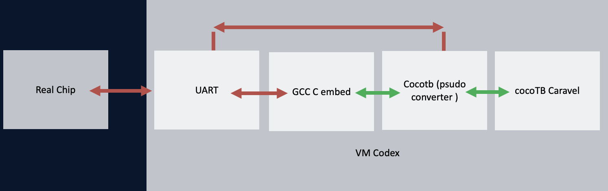

# BM Labs X1 IP Debug Firmware

This repository contains RISC-V firmware for debugging the BM Labs X1 IP through the Caravel management SoC. The current firmware sequence is focused on scan/debug reset behavior and is intended to run in both Caravel simulation and on the actual chip.

## Automated Debug Platform



The debug setup connects the same firmware-driven scan sequence to two targets:

- **Caravel + cocotb simulation** for automated regression, waveform inspection, and fast iteration.
- **Actual chip over UART** for silicon validation using the same checkpoint and log format.

The VM/Codex environment builds the embedded C firmware with GCC, drives the Caravel/cocotb path through a pseudo converter, and compares the behavior against the real chip path through UART logs.

## Repository Contents

```text
.
|-- README.md
|-- docs/
|   `-- automated-debug-platform.png
`-- top_tb_scan_debug_reset_sequence_riscv.c
```

`top_tb_scan_debug_reset_sequence_riscv.c` is a firmware translation of the `top_tb_scan_debug_reset_sequence.sv` testbench flow. It configures the Caravel GPIOs, enters scan debug mode, shifts scan words, checks reset behavior, and prints structured pass/fail checkpoints over UART.

## Scan Debug GPIO Map

The firmware uses the following Caravel GPIO mapping:

| GPIO | Signal | Direction | Notes |
| --- | --- | --- | --- |
| GPIO21 | `ScanInDR` | Output | Scan valid. Active low while shifting. |
| GPIO22 | `ScanInDL` | Output | Scan data. Shifted LSB first. |
| GPIO35 | `ScanInCC` | Output | Held low by this test. |
| GPIO36 | `TM` | Output | Enables scan debug mode. |

## Firmware Flow

1. Configure the Caravel management core, UART, and project GPIOs.
2. Enter scan debug mode with `TM` high.
3. Reset or settle the X1 IP.
4. Check the default selected cell after reset.
5. Shift 16-bit scan words for selected row/column targets.
6. Print checkpoint results over UART using the `[SCAN-RESET-SEQ]` prefix.
7. Exit scan debug mode and blink the management GPIO as a final pass/fail indicator.

The built-in sequence currently checks these cells:

| Step | Selected Cell |
| --- | --- |
| S1 | row 0, column 1 |
| S2 | row 0, column 2 |
| S3 | row 1, column 0 |

## Build And Run

This firmware expects the Caravel firmware headers:

- `defs.h`
- `stub.h`

Build it from a Caravel-compatible firmware environment with a RISC-V embedded GCC toolchain. A typical integration copies or references this C file from the Caravel firmware test directory and compiles it into the management firmware image used by the cocotb/Caravel test or the chip bring-up flow.

Example compiler shape:

```sh
riscv32-unknown-elf-gcc \
  -march=rv32imc -mabi=ilp32 \
  -I/path/to/caravel/firmware \
  -DSCAN_RESET_GPIO=255u \
  -o scan_debug.elf \
  top_tb_scan_debug_reset_sequence_riscv.c
```

Use the build command from your local Caravel project if it already provides a firmware Makefile.

## Useful Compile-Time Options

| Macro | Default | Purpose |
| --- | --- | --- |
| `SCAN_RESET_GPIO` | `255u` | Optional GPIO used to pulse the X1 IP reset. Values `0..37` enable reset drive. |
| `SCAN_BIT_DELAY` | `2000` | Delay between scan bit transitions. |
| `SCAN_RESET_SETTLE_DELAY` | `20000` | Delay after reset activity. |
| `SCAN_DEBUG_SETTLE_DELAY` | `8000` | Delay after entering scan debug or shifting a word. |
| `SCAN_DEBUG_STATUS_BASE` | undefined | Optional base address for readable debug status registers. |

When `SCAN_DEBUG_STATUS_BASE` is not defined, the firmware prints expected WL/BL/SL values but cannot hard-check internal X1 buses. After exposing readable debug registers in RTL, define `SCAN_DEBUG_STATUS_BASE` and override the `SCAN_DBG_*_OFFSET` macros if the register map differs.

## Expected UART Output

Successful runs produce structured UART logs similar to:

```text
[SCAN-RESET-SEQ] RISC-V scan-debug reset-sequence firmware start
[SCAN-RESET-SEQ][CP1][PASS] TM shadow is high in scan debug
[SCAN-RESET-SEQ][SHIFTED] S1 scan select cell (0,1) word=0x00008420
[SCAN-RESET-SEQ][SUMMARY][PASS] all checkpoints passed
```

These logs are used by the cocotb automation and by the real-chip UART path so the same pass/fail parsing can be reused across simulation and silicon.

## Debug Notes

- If the Caravel/cocotb simulation passes but the chip fails, compare UART checkpoint order, scan bit timing, and reset timing first.
- If all executable checkpoints pass but internal WL/BL/SL behavior is still uncertain, add readable RTL debug status registers and enable `SCAN_DEBUG_STATUS_BASE`.
- If the chip does not respond over UART, first confirm the management firmware is booting and that the Caravel GPIO configuration matches the package or board wiring.
